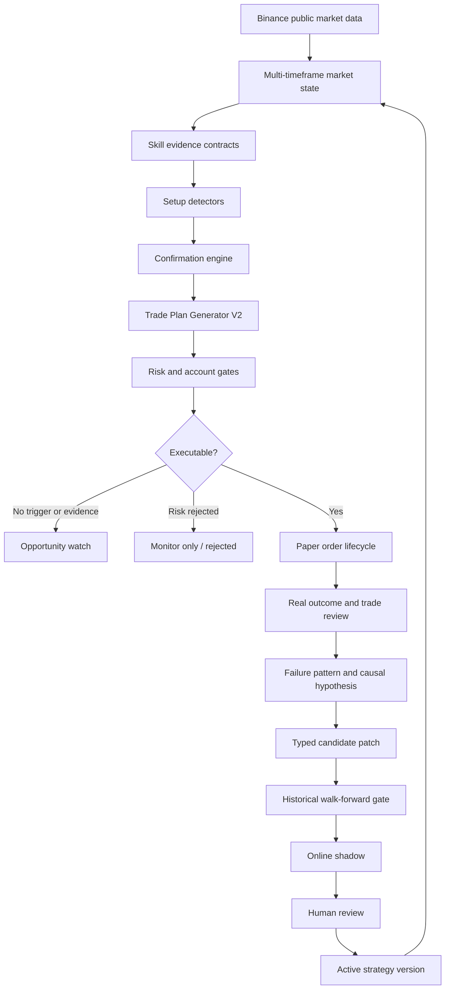

# CryptoGuard Strategy Intelligence Qualitative Upgrade

Status: Planning

Owner: GenericAgent / CryptoGuard

Date: 2026-06-05

## 1. Goal

Upgrade CryptoGuard from a system that mainly scores signals and rejects risky plans
into a setup-driven, evidence-linked, historically validated, self-improving crypto
analysis Agent.

The system must preserve GenericAgent as the master controller, master analyst, and
evolution coordinator. It must continue operating only in paper/simulation mode.

This task does not promise guaranteed profit. Its purpose is to establish the technical
and statistical conditions required for a strategy to demonstrate positive expectancy,
controlled drawdown, reproducibility, and continuous causal improvement.

## 2. Original Problem to Resolve

The user reported:

- persistent intraday paper losses and account drawdown reaching approximately -3.26%;
- entries and stops appearing to be placed mechanically at prior highs/lows;
- insufficient use of price action, order flow, Chanlun, momentum, trend, and reversal
  confirmation;
- trade plans that appear guessed rather than derived from an explicit setup;
- self-evolution and shadow testing that do not appear to learn from historical market
  data;
- completed fixes that improve containment but do not yet prove a path from loss to
  sustained positive expectancy.

The implementation is complete only when the system can explain, reproduce, test, and
audit why every order exists and why each strategy change should improve a measured
failure mode.

## 3. Current Baseline

### 3.1 Capabilities already implemented and to be preserved

- Account risk guard, risk-off, hard risk-off, and daily-loss pause.
- Symbol-side performance gate, cooldown, and LONG quality downgrade.
- Late-stage, RSI extension, order-flow conflict, and Chanlun conflict checks.
- Pending-order TTL, conflict cancellation, revalidation, and watch conversion.
- Real-PnL preference and pseudo-R promotion block in shadow testing.
- Historical paired replay gate for supported score changes.
- Evolution loop state repair, verdict runner, human review cards, and state diagnosis.
- Structured feedback, failure reflection, feedback TTL, and feedback-rule dry-run.
- Account-level feedback-rule bridge and shadow account feedback gate.
- State consistency clean-up and zero-physical-delete audit policy.

### 3.2 Capabilities not yet solved

- Setup-first trade-plan construction.
- Structured closed-candle entry confirmation generated by deterministic logic.
- Structural stop placement with no synthetic distance fallback.
- Liquidity/structure-aware target selection.
- Full use of price action, order flow, Chanlun, momentum, trend, and BTC context in
  plan construction.
- Multi-timeframe, real-rule historical replay.
- Walk-forward and out-of-sample validation.
- Typed candidate patches that alter real strategy behavior.
- Causal linkage from loss evidence to the next candidate.
- Evidence that recent changes improve expectancy rather than only reducing activity.

The detailed evidence is recorded in
`research/current-system-audit.md`.

## 4. Product Principles

These are non-negotiable.

1. **GenericAgent is the master**
   - Skills provide structured observations.
   - SOP provides deterministic reasoning.
   - LLM provides synthesis, contradiction analysis, and hypothesis generation.
   - GenericAgent makes and persists the final decision.

2. **No setup, no order**
   - A score, grade, support, resistance, FVG, or swing level alone is not a setup.
   - A paper order requires a named setup, context, trigger, invalidation, targets, and
     expiry.

3. **No trigger, watch only**
   - A valid directional thesis without a closed-candle trigger becomes an opportunity
     watch, never an immediate order.

4. **No structural invalidation, no trade**
   - The system must not manufacture a stop from a minimum percentage, range midpoint,
     or arbitrary offset when structure is absent.

5. **Missing evidence fails closed**
   - Missing/degraded order flow, Chanlun, entry quality, or timeframe data must be
     represented explicitly.
   - Required missing evidence causes watch/no-trade, not an implicit pass.

6. **Same rules online and in replay**
   - Historical replay must execute the same setup detectors, confirmation rules,
     trade-plan builder, risk gates, and candidate patch operations used online.

7. **Closed candles only**
   - Every feature, trigger, replay decision, and outcome calculation must preserve
     no-lookahead guarantees.

8. **Evolution changes causes, not labels**
   - A candidate must identify the failure pattern and change a typed executable rule.
   - Pure score shifts are allowed only when the diagnosed defect is score calibration.

9. **Human activation remains mandatory**
   - Backtest and shadow testing can move a candidate to `review_required`.
   - They must not automatically activate it.

10. **Risk containment is not alpha**
    - Gates can prevent losses, but acceptance of the strategy-quality work requires
      historical and forward evidence of improved expectancy.

## 5. Target Architecture



### 5.1 Layer responsibilities

| Layer | Responsibility | Must not do |
|---|---|---|
| Market state | Produce closed-candle multi-timeframe facts | Decide trades |
| Skill evidence | Normalize PA/order flow/Chanlun/momentum/trend evidence | Return prose-only conclusions |
| Setup detectors | Identify named, direction-specific opportunity structures | Create arbitrary stops |
| Confirmation engine | Verify trigger timing and evidence alignment | Treat missing data as confirmation |
| Plan generator | Build entry, invalidation, targets, expiry | Repair invalid plans synthetically |
| Risk gates | Reject/downgrade validly constructed plans | Invent the original trade thesis |
| Backtest | Replay identical executable rules | Compare only metadata or fake score offsets |
| Evolution | Generate typed rule changes from measured failures | Auto-activate candidates |

## 6. Required Data Contracts

### 6.1 Skill evidence contract

Every strategy-relevant skill result must expose structured fields:

```json
{
  "status": "ok|degraded|missing",
  "timeframe": "15m",
  "direction": "bullish|bearish|neutral",
  "quality": 0.0,
  "observations": [],
  "supports_long": [],
  "supports_short": [],
  "conflicts_long": [],
  "conflicts_short": [],
  "levels": [],
  "closed_at": 0,
  "source_refs": []
}
```

Rules:

- `quality` is 0.0-1.0 and must have deterministic provenance.
- `closed_at` must identify the latest closed candle used.
- `source_refs` must allow audit back to snapshot/module result.
- Prose may supplement but never replace structured fields.

### 6.2 Setup candidate contract

```json
{
  "setup_id": "stable identifier",
  "setup_type": "trend_pullback|breakout_retest|liquidity_sweep_reversal|range_reversion",
  "side": "LONG|SHORT",
  "symbol": "BTCUSDT",
  "context_timeframes": ["4h", "1h", "15m"],
  "execution_timeframe": "15m",
  "regime": "trending_up|trending_down|ranging|volatile|transition",
  "thesis": "structured explanation",
  "entry_zone": {"low": 0.0, "high": 0.0, "source": "structure/liquidity"},
  "structural_invalidation": {
    "price": 0.0,
    "source": "sweep_low|retest_low|swing_low|range_boundary",
    "condition": "15m close below ...",
    "evidence_refs": []
  },
  "target_map": [],
  "required_confirmations": [],
  "disqualifiers": [],
  "evidence_refs": [],
  "created_at": 0
}
```

### 6.3 Entry confirmation contract

```json
{
  "confirmed": true,
  "trigger_type": "rejection_close|engulfing_close|break_and_retest_close|micro_bos|sweep_reclaim",
  "timeframe": "15m",
  "trigger_candle_close_time": 0,
  "trigger_price": 0.0,
  "price_action_quality": 0.0,
  "order_flow_quality": 0.0,
  "momentum_quality": 0.0,
  "chanlun_quality": 0.0,
  "composite_quality": 0.0,
  "evidence_refs": [],
  "counter_evidence": []
}
```

Rules:

- `confirmed=false` cannot produce a paper order.
- A placeholder such as `auto`, `template`, or free text is invalid.
- Missing required quality fields cannot pass a stronger-confirmation gate.

### 6.4 Trade plan V2 contract

Required fields:

- `plan_version`
- `setup_id`
- `setup_type`
- `side`
- `entry_type`
- `entry_zone`
- `entry_price` or `trigger_price`
- `entry_trigger_confirmation`
- `stop_loss`
- `stop_source`
- `invalid_condition`
- `take_profits`
- `target_sources`
- `expected_rr`
- `max_holding_time`
- `expires_at`
- `risk_percent`
- `evidence_refs`
- `counter_evidence`
- `data_quality`

Every paper order must persist this contract or a lossless reference to it.

### 6.5 Typed strategy patch contract

Candidate patches must contain executable operations:

```json
{
  "hypothesis": "Late trend pullback entries fail without reclaim confirmation",
  "failure_pattern": "late_stage_long_loss",
  "evidence_ids": [],
  "operations": [
    {
      "op": "set_confirmation_requirement",
      "scope": {
        "setup_type": "trend_pullback",
        "side": "LONG",
        "regime": "trending_up"
      },
      "field": "entry_confirmation.composite_quality",
      "from": 0.65,
      "to": 0.75
    }
  ],
  "expected_effect": {
    "metric": "avg_r",
    "direction": "increase",
    "risk": "lower_trade_count"
  }
}
```

Supported operation types must be explicitly registered and validated. Unknown
operations fail the backtest gate and cannot enter online shadow.

## 7. Implementation Phases

The phases are sequential. Do not start a later phase before the previous phase's
acceptance criteria pass.

## Phase P0: Stabilize Current Feedback Gate and Configuration

### Objective

Remove current regressions before adding new strategy behavior.

### Required changes

1. Repair `trading_mode.yaml` hierarchy:
   - restore `min_r_count_for_performance_gate`, `online_shadow`, and `stale_cleanup`
     under `evolution`;
   - keep `account_feedback_rules` top-level;
   - add a config-shape regression test.

2. Persist every account feedback gate check:
   - `disabled`;
   - `action_disabled`;
   - `no_recent_pattern`;
   - `not_affected`;
   - active passed;
   - active failed.

3. Treat missing `entry_quality` as:
   - `data_quality_insufficient` in shadow;
   - failed confirmation in controlled mode.

4. Preserve symbol-side pairs:
   - use `[{"symbol":"BTCUSDT","side":"LONG"}]`;
   - do not use independent symbol and side sets for membership.

5. Implement controlled behavior before enabling it:
   - `annotate_only`: no behavior change;
   - `downgrade_to_watch`: prevent order and create/update opportunity watch;
   - `block_order`: prevent order with explicit audit reason;
   - shadow mode always records `would_decide`.

6. Synchronize schema:
   - migration;
   - `schema.sql`;
   - schema-health required column;
   - repository read/write path.

7. Add real broker integration tests for both creation entry points.

### P0 acceptance criteria

- Parsed config proves all evolution keys remain under `evolution`.
- 100% of attempted broker checks persist a gate result.
- Missing entry quality never counts as passing stronger confirmation.
- Symbol-side cross-product false positives are impossible.
- Controlled-mode tests prove order suppression/watch conversion.
- Existing evolution and stale-cleanup tests retain configured thresholds.
- Full test suite passes except documented pre-existing platform deselection.

## Phase P1: Trade Plan Generator V2

### Objective

Replace level-first plan construction with setup-first construction.

### Required setup types

Implement only these initial setup families:

1. **Trend pullback continuation**
   - HTF trend aligned;
   - pullback into structural/volume/liquidity area;
   - momentum resets without trend invalidation;
   - execution trigger confirms continuation.

2. **Breakout and retest**
   - closed breakout beyond a valid structure;
   - retest holds or rejects;
   - order flow does not oppose;
   - no late-stage chase.

3. **Liquidity sweep reversal**
   - sweep of identified liquidity;
   - reclaim/rejection close;
   - momentum divergence or deceleration;
   - Chanlun/PA reversal evidence where available.

4. **Range reversion**
   - regime explicitly classified as range;
   - entry only near range edge after rejection;
   - target is range interior/opposite liquidity;
   - trend strategies are disabled inside the range.

### Required behavior

- Implement LONG and SHORT symmetrically.
- A detector returns `None` when evidence is insufficient.
- Multiple candidates are ranked by setup quality, not merged into a vague direction.
- Plan generation occurs only after confirmation.
- Stop is derived from `structural_invalidation`.
- ATR may add a configurable buffer outside structure; it may not replace structure.
- Targets derive from liquidity, structure, or measured move; fixed-R targets may be
  secondary caps, not the only source.
- Remove these production fallbacks:
  - range midpoint entry;
  - midpoint-derived invalidation;
  - `entry +/- min_risk` synthetic stop;
  - 0.1% wrong-side stop repair.
- When no valid stop or target exists, return watch/no-trade.
- Existing `_build_trade_plan()` remains behind a temporary feature flag only during
  shadow comparison, then is deprecated and removed.

### Suggested module boundary

- `strategy/setup_detector.py`
- `strategy/confirmation_engine.py`
- `strategy/trade_plan_generator.py`
- `strategy/trade_plan_schema.py`

Exact filenames may follow local conventions, but responsibilities must remain separate.

### P1 acceptance criteria

- 100% of new paper orders contain a valid `setup_type`.
- 100% contain structured closed-candle confirmation.
- 100% contain `stop_source` and evidence-linked invalidation.
- Zero new plans use midpoint or synthetic-distance fallback.
- Missing confirmation produces watch, never order.
- LONG and SHORT fixtures cover every setup type.
- Existing risk gates consume V2 fields without duplicating setup logic.

## Phase P2: Multi-Dimensional Evidence Fusion

### Objective

Make PA, order flow, Chanlun, momentum, trend, and context participate in setup and
timing decisions rather than only vetoing completed plans.

### Required evidence matrix

For each setup, define:

- required evidence;
- optional supporting evidence;
- hard contradictions;
- degraded-data behavior;
- timeframe ownership.

Example:

| Setup | Required | Support | Hard contradiction |
|---|---|---|---|
| Trend pullback | HTF trend, pullback structure, trigger close | order flow, Chanlun, momentum reset | late stage, HTF reversal |
| Breakout retest | closed breakout, retest, trigger | volume/order flow | failed reclaim, range regime |
| Sweep reversal | liquidity sweep, reclaim | divergence, Chanlun class signal | strong continuation flow |
| Range reversion | range regime, edge rejection | mean reversion momentum | confirmed trend breakout |

### Required behavior

- Normalize all skill outputs into the evidence contract.
- Distinguish `neutral`, `missing`, and `degraded`.
- Compute setup quality from explicit components with a breakdown.
- Preserve counter-evidence; do not discard it after scoring.
- GenericAgent final synthesis must cite evidence IDs.
- LLM may not invent missing evidence or modify raw indicator values.
- If deterministic and LLM conclusions differ, persist both and apply deterministic
  safety constraints.

### P2 acceptance criteria

- Every setup quality score has a component breakdown.
- Every decision can be traced to snapshot/module result IDs.
- Degraded evidence produces deterministic watch/reject behavior.
- Counter-evidence is visible in decision, report, and replay output.
- No skill result is consumed through prose parsing when structured fields exist.

## Phase P3: Historical Replay and Backtest Engine V2

### Objective

Use Binance public historical data to test the real strategy logic over multiple market
conditions before relying on online shadow samples.

### Data requirements

- Use public Binance USD-M futures klines and available public market data only.
- Simulation only; no order endpoint or API key capable of trading.
- Minimum research window:
  - fast candidate screening: 60-90 days;
  - promotion evidence: target 180+ days when data exists;
  - include trending up, trending down, range, high-volatility, and transition periods.
- Use at least 4h, 1h, 15m, and 5m data where required by the online pipeline.
- Record source, download time, missing intervals, and checksum/row counts.

### Replay requirements

- Build each decision using only candles closed at the decision timestamp.
- Execute the same V2 setup, confirmation, plan, risk, and patch code used online.
- Apply typed candidate patch operations to candidate configuration.
- Model:
  - limit/trigger/market entry rules;
  - non-filled and expired orders;
  - conservative same-candle TP/SL ambiguity;
  - partial take profits;
  - fees;
  - configurable slippage;
  - timeout;
  - account risk pauses;
  - overlapping-position constraints.
- Persist raw trade sequence, MFE, MAE, R, fees, regime, setup type, side, symbol, and
  evidence quality.

### Validation design

Use rolling walk-forward validation:

1. Training/calibration window.
2. Validation window for candidate selection.
3. Untouched out-of-sample window for gate decision.

At minimum, report:

- trade count;
- fill rate;
- win rate;
- average R;
- median R;
- profit factor;
- maximum drawdown;
- maximum consecutive losses;
- expectancy after fees;
- MFE/MAE;
- performance by symbol, side, setup, regime, and timeframe;
- confidence calibration;
- active-vs-candidate paired deltas;
- bootstrap confidence interval or equivalent uncertainty estimate.

### Backtest gate rules

A candidate cannot pass only because win rate rises. It must satisfy configurable
minimums including:

- no-lookahead passes;
- enough actual simulated trades;
- out-of-sample expectancy greater than zero;
- profit factor meets the configured floor;
- drawdown does not exceed account safety limits or materially worsen baseline;
- improvement is not isolated to one symbol or one regime unless the patch scope is
  explicitly narrow;
- result remains acceptable after fees and conservative slippage;
- candidate changes actual decisions or plans; no-op candidates fail.

Initial defaults for research, not permanent guarantees:

- OOS actual trades: at least 50 across the intended scope;
- OOS average R: greater than 0;
- profit factor: at least 1.15;
- candidate average-R improvement: at least 0.05R;
- maximum drawdown: no worse than baseline by more than 10% relative;
- minimum 2 regimes and 3 symbols for broad-scope patches.

Threshold changes require recorded evidence and human approval.

### P3 acceptance criteria

- Replay reproduces online decision contracts.
- Candidate patches alter real executable behavior.
- No-lookahead tests cover all timeframes and trigger timing.
- Fees/slippage and pending-order lifecycle affect results.
- Walk-forward/OOS reports are persisted and reproducible.
- A deliberately overfit candidate fails OOS.
- A no-op candidate fails.

## Phase P4: Causal Self-Evolution Loop

### Objective

Turn review memory into testable strategy hypotheses and controlled iterations.

### Required closed loop

```text
closed trade
-> outcome attribution
-> failure pattern
-> affected setup/symbol/side/regime
-> causal hypothesis
-> typed candidate patch
-> historical walk-forward gate
-> online shadow
-> failure reflection or human review
-> memory update
```

### Candidate requirements

Every candidate must record:

- source trade/review/feedback IDs;
- failure pattern and sample statistics;
- intended scope;
- hypothesis;
- typed operations;
- expected benefit and expected trade-off;
- baseline version;
- backtest dataset and split IDs;
- backtest result;
- shadow result;
- review decision.

### Failure behavior

When backtest or shadow fails:

- mark candidate consistently across trigger, patch, and version;
- write structured failure reflection;
- explain whether failure came from data quality, insufficient samples, no effect,
  expectancy, drawdown, regime instability, or execution realism;
- generate at most two rate-limited draft revisions per original trigger;
- require human approval before a draft enters candidate testing;
- do not create another patch when an unresolved candidate already exists.

### Memory behavior

- Prefer real trade and historical replay outcomes over pseudo-score evidence.
- Weight by recency, symbol-side relevance, setup type, and regime.
- Prevent high-volume schema/validation noise from dominating memory.
- Protect memory referenced by active experiments.
- Record when a memory item was applied and whether the expected effect occurred.

### P4 acceptance criteria

- Every candidate has a complete causal chain.
- Score-only candidate creation is rejected unless calibration is the stated cause.
- Failed candidates produce structured learning, not indefinite shadow stagnation.
- Duplicate candidate creation remains impossible.
- State consistency remains zero issues after each transition.

## Phase P5: Controlled Rollout and Account Recovery

### Objective

Introduce behavior changes gradually while the paper account is in drawdown.

### Rollout stages

1. **Shadow compare**
   - V1 and V2 analyze the same closed snapshots.
   - Only V1 may create paper orders.
   - Persist divergence and hypothetical outcomes.

2. **Watch-only V2**
   - V2 can create opportunity watches.
   - No V2 paper orders.

3. **Restricted paper execution**
   - Only setups passing historical gate and forward shadow.
   - Reduced risk percentage.
   - Per-setup/symbol/side caps.

4. **Normal paper execution**
   - Only after account recovery and evidence thresholds pass.

### Account recovery constraints

- Current drawdown must not be recovered by increasing risk or trade frequency.
- Hard risk-off and daily-loss pause remain authoritative.
- New strategy rollout starts at reduced risk.
- Expansion requires:
  - positive rolling real average R;
  - controlled consecutive losses;
  - no state consistency issues;
  - no shadow data-quality alert;
  - sufficient OOS and forward samples.

### Online sample policy

- Historical backtest may reduce the time needed to become `review_required`.
- Five online signals are sufficient only for an early human review checkpoint.
- Normal paper activation should prefer at least 20 real/hypothetical outcome samples
  for the changed setup when feasible.
- Pseudo-R does not count toward activation evidence.

### P5 acceptance criteria

- V1/V2 divergence is measurable.
- Rollback is one config/version switch.
- Risk never increases automatically after losses.
- Account recovery report separates avoided trades, hypothetical V2 trades, and actual
  paper outcomes.

## Phase P6: Explainability, Reporting, and Operator Controls

### Required reporting

For every paper order or watch, expose:

- setup type and market regime;
- HTF thesis;
- entry zone and exact trigger;
- confirmation evidence;
- counter-evidence;
- structural stop source;
- target sources;
- expected RR;
- expiry/revalidation conditions;
- all gates and final action;
- strategy version and candidate/active identity.

Hourly/daily reports must include:

- account drawdown and risk state;
- actual and avoided trade performance;
- performance by setup, side, symbol, and regime;
- gate activation/pass/fail/no-data rates;
- shadow/backtest data quality;
- active candidates and causal hypotheses;
- top failure patterns and whether a rule acted on them;
- state consistency issues.

### Operator controls

- Approve/reject candidate.
- Pause a setup, symbol-side, or strategy version.
- Roll back active version.
- Force historical re-evaluation.
- Inspect evidence and backtest artifacts.
- No control may enable real trading.

### P6 acceptance criteria

- An operator can explain any order without reading source code.
- Reports distinguish reduced activity from improved expectancy.
- All manual actions are idempotent, audited, and retry-safe.

## 8. File-Level Implementation Map

Likely files and responsibilities:

| Area | Existing files | Intended work |
|---|---|---|
| Current hotfix | `config/trading_mode.yaml`, `risk/account_feedback_gate.py` | P0 corrections |
| Decision construction | `reasoning/ga_judge.py`, `reasoning/decision_schema.py` | Route through V2 contracts |
| Setup/confirmation | new modules under `strategy/` or `reasoning/` | Detectors and trigger engine |
| Skill normalization | `analysis/*`, skill runners | Structured evidence contracts |
| Risk | `risk/risk_engine.py`, `ga_master/risk_gate.py` | Consume V2 plan, no thesis invention |
| Controller | `ga_master/controller.py` | Persist V1/V2 and divergence |
| Paper broker | `paper/paper_broker.py` | Enforce controlled decisions and V2 plans |
| Pending lifecycle | `paper/pending_*` | Revalidate against setup invalidation |
| Backtest | `backtest/historical_replay.py` | Multi-timeframe real-rule engine |
| Evolution | `strategy/shadow_testing.py`, `strategy/self_evolution.py`, `review/*` | Typed causal patches |
| Storage | `storage/schema.sql`, `migrations.py`, `repository.py` | Contracts and artifacts |
| Reports | `notify/hourly_report.py`, daily review/report modules | Explainability and metrics |
| Specs | `.trellis/spec/backend/crypto-guard-conventions.md` | New conventions after each phase |

The implementer must inspect the repository before finalizing module locations. Do not
create parallel abstractions when an existing owner can be extended cleanly.

## 9. Testing Strategy

### 9.1 Unit tests

- Every setup detector, both sides.
- Trigger confirmation and closed-candle enforcement.
- Structural invalidation and ATR buffer.
- Missing/degraded evidence.
- Typed patch validation and application.
- Fee/slippage/outcome calculation.
- Config hierarchy and default behavior.

### 9.2 Integration tests

- Snapshot -> evidence -> setup -> confirmation -> plan -> risk -> broker.
- Broker -> order -> fill/expiry -> trade -> review -> feedback.
- Feedback -> candidate -> backtest -> shadow -> review.
- Active/candidate divergence persistence.
- Schema migration plus fresh `schema.sql` database parity.

### 9.3 Replay regression tests

- Known trend continuation fixture.
- Known failed breakout fixture.
- Known liquidity sweep reversal fixture.
- Known range fixture.
- Same-candle TP/SL ambiguity.
- Missing candle interval.
- Candidate no-op.
- Candidate overfit.
- Multi-timeframe no-lookahead.

### 9.4 Property/invariant tests

- LONG/SHORT symmetry where rules are mirrored.
- Stop is always beyond structural invalidation in the correct direction.
- No order without confirmation.
- No candidate activation without human review.
- No strategy state transition leaves trigger/patch/version inconsistent.
- Replay never reads a candle closed after decision time.

### 9.5 Production-data diagnostics

Before and after each phase:

- schema health;
- state consistency;
- config shape;
- count of decisions/orders missing V2 fields;
- shadow data source distribution;
- candidate status distribution;
- account drawdown and daily pause state.

Production database checks must be read-only unless a separately approved migration or
data backfill is part of the task.

## 10. Delivery Strategy

This program must be split into child Trellis tasks. Do not implement the entire PRD in
one commit or one agent pass.

Recommended child tasks:

1. `P0 feedback gate and config hotfix`
2. `P1 trade plan V2 contracts and setup detectors`
3. `P2 evidence fusion and GenericAgent synthesis`
4. `P3 backtest engine V2 and Binance historical dataset`
5. `P4 typed causal evolution`
6. `P5 controlled rollout and account recovery`
7. `P6 explainability and operator controls`

Each child task must:

- have its own PRD and tests;
- list exact files and migrations;
- preserve a rollback path;
- update conventions with new durable rules;
- produce a review report before the next child task starts.

## 11. LLM Execution Instructions

The implementing LLM must follow this sequence:

1. Read this PRD, the current-system audit, Trellis workflow, and relevant specs.
2. Inspect the actual code and database schema; do not trust summaries alone.
3. Create or activate only the next child task.
4. Map the complete data flow before editing.
5. Write failing tests for the child task's acceptance criteria.
6. Implement the smallest coherent change.
7. Run focused tests, then the full CryptoGuard suite.
8. Run schema health and state consistency diagnostics.
9. For strategy behavior changes, run historical replay and attach artifacts.
10. Review for lookahead, synthetic fallback, missing-data pass-through, and state drift.
11. Update specs and the parent checklist.
12. Stop and request review before advancing to the next phase.

### Forbidden shortcuts

- Do not lower grade/confidence thresholds merely to generate more trades.
- Do not increase risk to recover drawdown.
- Do not label a gate or unit test result as evidence of profitability.
- Do not use pseudo-R as promotion evidence.
- Do not compare candidates only through a scalar score adjustment when the patch
  changes structure or execution.
- Do not create stops or entries solely to satisfy schema validation.
- Do not treat missing data as neutral confirmation.
- Do not add a new gate where the correct fix belongs in setup construction.
- Do not auto-activate a strategy version.
- Do not call real trading APIs.

### Required completion report for every child task

```text
Goal:
Behavior changed:
Files changed:
Data/schema changes:
Tests:
Historical validation:
Forward/shadow validation:
Metrics before vs after:
Known limitations:
Rollback:
State consistency:
Next phase readiness:
```

## 12. Program-Level Acceptance Criteria

The qualitative upgrade is complete only when all are true:

### Strategy quality

- Every paper order comes from a named setup and structured trigger.
- No production plan uses midpoint or synthetic-distance fallback.
- Stops and targets cite structural/liquidity sources.
- Order flow, Chanlun, momentum, trend, PA, and context have explicit roles.
- LONG and SHORT are both covered by symmetric setup logic.

### Historical evidence

- The real online rule path is replayed on multi-timeframe Binance history.
- Walk-forward and untouched OOS validation pass configured thresholds.
- Results include fees, slippage, non-fills, expiry, and account constraints.
- Performance is broken down by setup, symbol, side, and regime.

### Evolution quality

- Every candidate has a causal hypothesis and typed executable operations.
- Every promotion decision uses real or historical outcome evidence.
- Failed candidates generate structured reflection and bounded revisions.
- Trigger, patch, and version states remain consistent.

### Account recovery

- Risk-off protections remain active until objective recovery conditions pass.
- Rolling real paper expectancy improves above zero before normal risk resumes.
- Drawdown remains inside configured limits.
- Improvement is not explained only by taking fewer trades.

### Operability

- Every decision and manual action is auditable.
- Reports make missing data and uncertainty visible.
- Rollback is tested.
- Full tests, schema health, and state diagnostics pass.

## 13. Definition of Success

Success is not “the latest day was profitable” and not “all tests pass.”

Success means:

- trade plans are logically derived and auditable;
- candidate rules can be replayed exactly;
- positive expectancy is demonstrated out of sample after costs;
- forward paper results are directionally consistent with historical evidence;
- losses produce bounded, causal, testable evolution;
- the system knows when it does not have enough evidence and chooses not to trade.

## 14. Out of Scope

- Real-money order placement.
- Promises of guaranteed or continuous profit.
- Unbounded autonomous parameter search.
- Activation without human confirmation.
- Physical deletion of audit history.
- Replacing GenericAgent with a collection of independent strategy bots.

## 15. Parent Checklist

- [ ] User approves this PRD.
- [ ] P0 child task completed and reviewed.
- [ ] P1 child task completed and reviewed.
- [ ] P2 child task completed and reviewed.
- [ ] P3 child task completed and reviewed.
- [ ] P4 child task completed and reviewed.
- [ ] P5 child task completed and reviewed.
- [ ] P6 child task completed and reviewed.
- [ ] Program-level acceptance criteria verified.

